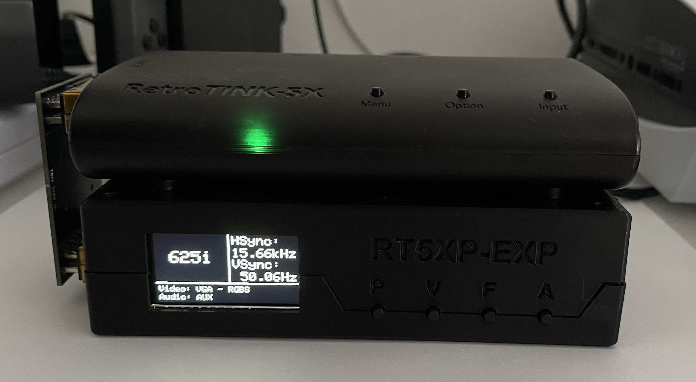

# RT5XP-EXP
A input expander for the RetroTINK 5X-Pro

---
## Introduction
The RT5XP-EXP is a purpose build device to extend the input capabilities of the RetroTINK 5X-Pro.

### Input
The Following video signals are supported:

- SCART (RGBS, RGsB, YPbPr)
- Component (YPbPr, RGsB)
- VGA (RGBHV, RGBS, RGsB, YPbPr)

Audio signals can be input as RCA, 3.5mm Jack or SCART and can be selected independently of the video signal.

The sync on scart and component inputs need to be attenuated 75 Ohm signals.
Scart also supports a attenuated CSync signal as the sync input.

The VGA input only supports TTL signals on the sync pins. When using RGsB/YPbPr these need attenuated correctly (which they should be in the first place). VGA also supports TTL CSync on pin 13.

**Input Resolution***: 240p - 1080i

Switching between resolutions is seamless.

### Output

The RT5XP-EXP outputs the signal in RGBS format out of the left scart connector. This signal should be safe to plug into any scart device. The sync signal is a attenuated csync signal.

**Output Resolution***: 240p - 1080i

*Tested on a RetroTINK 5X-Pro and a OSSC

### Display
The big area on the top left shows the line count* of the current input.
The area on the right shows the measured* horizontal and vertical sync signal.
At the bottom the display shows the currenty used and video and audio input.

*The values may not be 100% accurate but close enough.

### Buttons
- P: Cycles thought presets.
- V: Cycles thought different video inputs.
- F: Cycles thought different formats of the current video input.
- A: Cycles thought different audio inputs.

Holding the P button opens a menu. This menu is still WIP.

---
## Hardware
The hardware consists of following things:

- [Main PCB](./Hardware/MainPCB)
- [Display bracked PCB](./Hardware/DisplayPCB)
- [Case](./Hardware/Case)
- [(Optional) SCART PCB](./Hardware/InterconnectPCB)
- [Display](https://www.adafruit.com/product/5394)

---
## Firmware
NOTE: Is still WIP but usable for the basics
- [Firmware](./Firmware)

The firmware is based on a ATmega4809.
I used the Arduino IDE with following libraries:
- [MegaCoreX](https://github.com/MCUdude/MegaCoreX)
- [Adafruit_ST7789](https://github.com/adafruit/Adafruit-ST7735-Library)
- [Adafruit_GFX](https://learn.adafruit.com/adafruit-gfx-graphics-library/overview)

The microcontroller can be flashed via the usb connection.

---
## Misc
Technically the RT5XP-EXP should be support 1080p resolution but i could not test it.

---
## Known issues
On sharp edges there is a purple "color bending". In game this isn't that noticable or might not be noticed at all.

